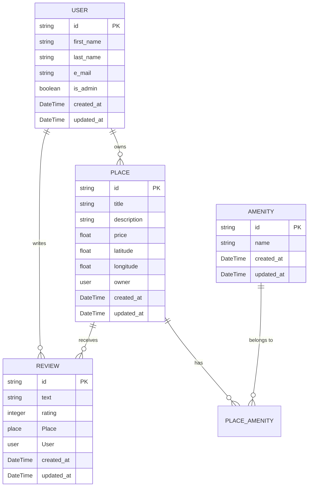

# HBNB Part 2 - BL and API

## Version 1.0.0
Release Date: 2 march 2025

This is the `1.0.0` version of the project ! First release !

## Disclaimer
For more information about this project, please refer to Part 1 README.md and Part 2 README.md !
[Link to part1 README](../../part1/README.md)
[Link to part1 README](../../part2/README.md)


## Intro
After created the projecture structure in part 1, and implement business logic and creating endpoint for the RESTfulAPI, the aim of this part 3 is to enhance backend with authentication and database integration

### Explanation
**Authentication and Authorization:**
- Implement JWT-based user authentication using Flask-JWT-Extended.
- Enforce role-based access control with the is_admin attribute for specific endpoints.

**Database Integration:**
- Replace in-memory storage with SQLite for development using SQLAlchemy as the ORM.

**CRUD Operations with Database Persistence:**
- Refactor all CRUD operations to interact with a persistent database.

**Database Design and Visualization:**
- Design the database schema using mermaid.js.
- Ensure all relationships between entities are correctly mapped.
-
**Data Consistency and Validation:**
- Enforce data validation and constraints in the models.
-
**Security and Scalability:**
- Ensure the backend is secure, scalable, and provides reliable data storage for production environments.

## Getting started
**Disclaimer : These explanations are valid on a Linux system only.**

### Prerequisite
- `Linux system` (tested on Linux Mint 22.1 x86_64 with 6.8.0-52-generic kernel )
- `Python3` (version 3.12.3)
- `venv`
- `Postman` (for testing only)

### Installation
1. Clone / download the repository
`git clone https://github.com/OursBlanc42/holbertonschool-hbnb`

2. Go to the right directory
`cd holbertonschool-hbnb/part3/hbnb`

3. Setup a virtual environnement
`python3 -m venv venv`

4. Activate virtual env
`source venv/bin/activate`

5. Install the Python packages needed for the project. There are listed in requirements.txt as explained before.
`pip install -r requirements.txt`

6. From this virtual environnement you can now run the application
`python run.py`

7. If everything has gone well, the terminal should display
```
 * Serving Flask app 'app'
 * Debug mode: on
WARNING: This is a development server. Do not use it in a production deployment. Use a production WSGI server instead.
 * Running on http://127.0.0.1:5000
Press CTRL+C to quit
 * Restarting with stat
 * Debugger is active!
 * Debugger PIN: 781-035-494
```

8. Now, you can enjoy and try the API with cURL, Postman, Swagger web UI, or whatever... See examples below


### Testing
For this part of the project, we made our test with a Postman collection. You can find the Postman file in the `hbnb/tests` directory.

#### About testing

For a better explanation of the collection of tests carried out in postman, we have grouped them by ‘category’ and not exactly in ‘chronological’ order.

-   **Authentication and Authorization:**
    -   Retrieve admin user ID and JWT token for admin. (Default admin account is prealably existing for testing)
    -   Log in as admin and retrieve JWT token
    -   Create a user "John" from admin and retrieve JWT token for John
    -   Log in as John and retrieve JWT token
    -   Attempt to create a user "Jane" from John (should fail due to insufficient permissions)
    -   Create a user "Jane" from admin and retrieve JWT token for Jane

-   **User Management:**
    -   Access protected endpoints as John and Jane to verify permissions
    -   Update user details for John and Jane, ensuring proper validation and constraints
    -   Attempt invalid updates to user details to test error handling

-   **Place Management:**
    -   Create places for John and Jane, ensuring proper authorization
    -   Update and list places to verify CRUD operations
    -   Attempt to update places with invalid data to test error handling

-   **Review Management:**
    -   Create reviews for places by John and Jane
    -   Update and delete reviews to verify CRUD operations
    -   Attempt to update or delete reviews with insufficient permissions to test error handling

-   **Amenity Management:**
    -   Create amenities as admin and attempt to create as a non-admin user (should fail)
    -   List, update, and modify amenities to verify CRUD operations
    -   Attempt to modify amenities with insufficient permissions to test error handling

-   **Data Validation:**
    -   Ensure all CRUD operations enforce data validation and constraints
    -   Test edge cases and invalid inputs to verify robustness of the API

-   **Complete Workflow Simulation:**
    -   Simulate a complete workflow from user creation, place and review management, to amenity handling
    -   Verify the API's ability to handle a sequence of operations in a real-world scenario


## Database

### Tables and Relationships

#### Users Table (users)
- **Attributes:**
    - `id` (String, Primary Key, UUID)
    - `first_name` (String, Required)
    - `last_name` (String, Required)
    - `email` (String, Unique, Required)
    - `password` (String, Required)
    - `is_admin` (Boolean, Default: False)
    - `created_at` (DateTime, Auto-generated)
    - `updated_at` (DateTime, Auto-updated)
- **Relationships:**
    - One-to-Many with places (Owner of places)
    - One-to-Many with reviews (Author of reviews)

#### Places Table (places)
- **Attributes:**
    - `id` (String, Primary Key, UUID)
    - `title` (String, Required)
    - `description` (Text, Optional)
    - `price` (Float, Required)
    - `latitude` (Float, Required)
    - `longitude` (Float, Required)
    - `owner_id` (String, Foreign Key to users.id, Required)
    - `created_at` (DateTime, Auto-generated)
    - `updated_at` (DateTime, Auto-updated)
- **Relationships:**
    - One-to-Many with reviews (Place being reviewed)
    - Many-to-Many with amenities (Amenities associated with the place)

#### Reviews Table (reviews)
- **Attributes:**
    - `id` (String, Primary Key, UUID)
    - `text` (Text, Required)
    - `rating` (Integer, Required, Range: 1-5)
    - `user_id` (String, Foreign Key to users.id, Required)
    - `place_id` (String, Foreign Key to places.id, Required)
    - `created_at` (DateTime, Auto-generated)
    - `updated_at` (DateTime, Auto-updated)
- **Relationships:**
    - Many-to-One with users (Author of the review)
    - Many-to-One with places (Place being reviewed)

#### Amenities Table (amenities)
- **Attributes:**
    - `id` (String, Primary Key, UUID)
    - `name` (String, Required, Unique)
    - `created_at` (DateTime, Auto-generated)
    - `updated_at` (DateTime, Auto-updated)
- **Relationships:**
    - Many-to-Many with places (Places associated with the amenity)

#### Association Table (place_amenity)
- **Attributes:**
    - `place_id` (String, Foreign Key to places.id, Primary Key)
    - `amenity_id` (String, Foreign Key to amenities.id, Primary Key)
- **Purpose:**
    - Facilitates the Many-to-Many relationship between places and amenities.

#### Summary of Relationships
- **Users:**
    - Own multiple Places (One-to-Many)
    - Write multiple Reviews (One-to-Many)
- **Places:**
    - Have multiple Reviews (One-to-Many)
    - Have multiple Amenities (Many-to-Many)
- **Reviews:**
    - Belong to one User (Many-to-One)
    - Belong to one Place (Many-to-One)
- **Amenities:**
    - Are associated with multiple Places (Many-to-Many)

### ER Diagram



# HairBedsnBeers (HBnB) - Part 4: Web Client

## Overview
This is the fourth part of the HairBedsnBeers project, focusing on the web client implementation. This web client connects to the RESTful API developed in Part 3 to provide a user-friendly interface for interacting with the HBnB platform.

## Features
- Browse available places
- Filter places by price, city, and country
- View detailed information about places
- User authentication (login/logout)
- Add and view reviews for places
- Responsive design for mobile and desktop

## Prerequisites
- Web server (can be a simple HTTP server)
- Modern web browser (Chrome, Firefox, Safari, Edge)
- The HBnB API server running (from Part 3)

## Project Structure
```
part4/
├── index.html            # Main landing page showing all places
├── login.html            # User login page
├── place.html            # Detailed view for a specific place
├── add_review.html       # Page for adding reviews to a place
├── styles.css            # CSS styles for the application
├── scripts.js            # JavaScript functionality
├── images/               # Images and assets
└── tests/                # Tests for the web client
    └── HBNBv2.postman_collection.json  # Postman collection for testing the API
```

## Running the Web Client

### Method 1: Using Python's built-in HTTP server
1. Navigate to the part4 directory:
   ```
   cd holbertonschool-hbnb-part4/part4
   ```

2. Start a simple HTTP server:
   ```
   # For Python 3
   python -m http.server 8080

   # For Python 2
   python -m SimpleHTTPServer 8080
   ```

3. Open your browser and navigate to:
   ```
   http://localhost:8080
   ```

### Method 2: Using Node.js http-server
1. Install http-server if you haven't already:
   ```
   npm install -g http-server
   ```

2. Navigate to the part4 directory:
   ```
   cd holbertonschool-hbnb-part4/part4
   ```

3. Start the server:
   ```
   http-server -p 8080
   ```

4. Open your browser and navigate to:
   ```
   http://localhost:8080
   ```

### Method 3: Using any other web server
You can use any web server of your choice (Apache, Nginx, etc.) to serve the static files. Just make sure to configure the web server to serve the part4 directory as the root.

## Connecting to the API

By default, the web client is configured to connect to the API at `http://localhost:5000/api/v1`. If your API is running on a different host or port, you need to modify the `API_BASE_URL` constant in `scripts.js`.

To start the API server:
1. Navigate to the part3 directory:
   ```
   cd holbertonschool-hbnb-part3/part3/hbnb
   ```

2. Activate the virtual environment:
   ```
   source venv/bin/activate  # Linux/Mac
   venv\Scripts\activate     # Windows
   ```

4. Run the application:
   ```
   ./setup.sh
   ```

## Testing

### API Testing with Postman
1. Import the Postman collection from `tests/HBNBv2.postman_collection.json`
2. Make sure the API server is running
3. Run the collection in Postman

### Web Client Manual Testing
1. Launch the web client as described above
2. Test the following functionality:
   - Browse places on the homepage
   - Apply filters (price, city, country)
   - View place details by clicking on a place
   - Log in using the admin account (email: admin@example.com, password: admin123)
   - Add a review to a place
   - Log out

## User Accounts for Testing
- Admin users:
  - Email: admin@HairBedsnBeers.com
  - Password: admin123
  - Email: admin@example.com
  - Password: admin123


## Troubleshooting

### CORS Issues
If you encounter CORS (Cross-Origin Resource Sharing) issues, make sure your API server has CORS enabled. In the Part 3 Flask API, this is typically handled by the Flask-CORS extension.

## Browser Compatibility
The web client has been tested and should work properly on:
- Chrome (latest 2 versions)
- Firefox (latest 2 versions)
- Safari (latest 2 versions)
- Edge (latest 2 versions)

## Credits
- HairBedsnBeers Team
- Holberton School
